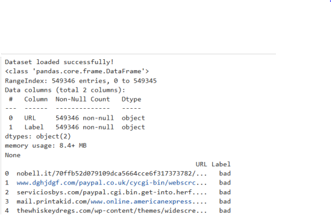
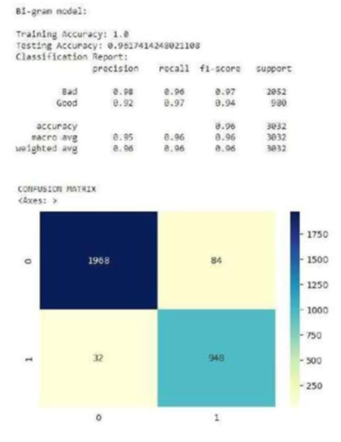
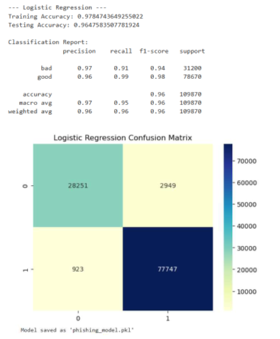
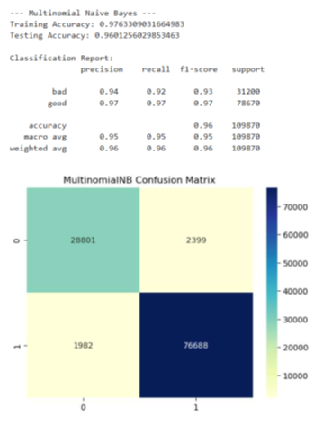

# Phishing Website Detection using Machine Learning and NLP

## Overview
This project detects phishing websites by analyzing URL patterns using *Natural Language Processing (NLP)* and *Machine Learning* techniques.  
The system classifies URLs as *phishing or legitimate* based on learned patterns from the dataset.

---

## Technologies Used
- Python
- Pandas
- NumPy
- Scikit-learn
- NLTK
- Matplotlib
- Seaborn

---

## Features
- URL preprocessing and tokenization using NLP
- Feature extraction using CountVectorizer
- Training multiple machine learning models
- Classification of URLs as phishing or legitimate
- Visualization of model performance

---

## Workflow
1. Dataset collection
2. URL preprocessing and tokenization
3. Feature extraction using NLP techniques
4. Training machine learning models
5. Evaluating model performance

---

## Machine Learning Models Used
- Logistic Regression
- Multinomial Naive Bayes
- Bigram Model

---

## Project Output

### Bigram Model

### Logistic Regression

### Multinomial Naive Bayes

---

## Applications
- Detect phishing websites
- Improve browser security
- Email spam and phishing filtering
- Cybersecurity threat detection

---

## Future Improvements
- Deploy the model as a web API
- Integrate with a browser extension
- Improve model accuracy using deep learning

---

## Author
*Monashree S V*
